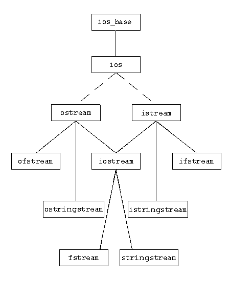

### Задача 1 - Not so Quine - Класиката

https://en.wikipedia.org/wiki/Quine_(computing)

* Напишете програма, която отпечатва собствения си source code.

### Задача 2 - File Placeholder Replace

В практиката често се налага да се направи копие на текстов файл, като определени шаблони в текста са заменени с конкретни стойности. 

Да се напише програма за работа с шаблони (placeholders) в текстов файл.

Програмата трябва да прочете даден файл и да направи копие, в което
шаблоните са заменени с конкретни стойности.

* Бонус конкретните стойности се зареждат от друг файл със следния формат:
```
title Veliki
recipient_name Pop Armeniya
message Iskam da se oplacha!!! 
sender_name Ivan Penev
```

Пр.
Изчита се:
```
Dear, {title} {recipient_name}.

{message}

Sincerely,
{sender_name}
```

Новият файл със заменени стойности съдържа:
```
Dear, Veliki Pop Armeniya.

Iskam da se oplacha!!!

Sincerely,
Ivan Penev
```


### Задача 3*  - ZUZI

Всички сме чували за информационната система на IMF - ZUZI.  
Имплементирайте модул от ZUZI, който трябва да се грижи   
за обработката и съхраняването на информация за избираемите дисциплини.

Една избираема дисциплина трябва да съдържа следната информация:

1. ID
2. Име
3. Категория - `{OKN, M, PM, PR, Other}`
4. Брой кредити, които носи.
5. Вид на изпита - `{ Exam, Course Project, Test }`
  - Обърнете внимание, че изпитът на една дисциплина може да бъде и съчетание от горните три. 

От конзолата да се приема път към файл, в който ще се записват данните.
> Важно условие е форматът на файла да бъде CSV.

Първият ред трябва да съдържа заглавните полета (атрибути).

За CSV (comma-separated values) формата може да прочетете повече тук:
https://en.wikipedia.org/wiki/Comma-separated_values

Модулът трябва да покрива минимално следните изисквания:
- Данните да могат да се съхраняват в подходящ файл.
- Данните да могат да се зареждат от подходящ файл.
- Да може да се добавя избираема дисциплина.
  - Ако подаденото ID на дисциплина вече е заето, то да се презаписва информацията за старата дисциплина. 
- Да може да се премахва избираема дисциплина по ID.
- Възможност за извършване на следните справки:
  - Търсене на избираема дисциплина по ID и отпечатване.
  - Да се извеждат всички избираеми дисциплини по селектирана категория.
  - Да се извеждат всички избираеми дисциплини по даден затворен интервал [minC, maxC], където minC e минимален брой кредити, а maxC е максимален брой кредити, които избираемата носи.

Бонус:
* Да се направи потребиталски интерфейс за работа през конзолата. Създаденият "CLI" да се зарежда от файл.

> За задачата е позволено използването на:

