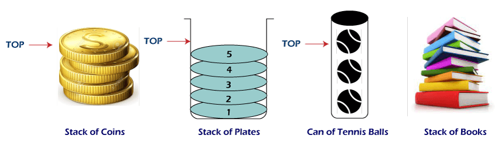

# Задача 1 - Reverse it

Съществуват популярни колекции от данни, които улесняват работата на програмите и по-конкретно - тяхната задача да съхраняват и обработват данни.

Една такава колекция е структурата стек (stack).

Вече знаете, че рекурсията се осъществява посредством тази абстракция.

Освен рекурсията, стекът има и много други приложения:

- Syntax Parsing
- Data Reversal
- Undo / Redo Operations
- Evaluation of Arithmetic Expressions
- etc.

https://en.wikipedia.org/wiki/Stack_(abstract_data_type)

А) Да се създаде структура IntStack, която работи с целочисления тип `integer`.
Имплементирайте следната фукционалност:
- `void push(int element)` - добавя елемент на върха на стека.
- `void pop()` - премахва елемент от върха на стека.
- `int top()` - връща елемента на върха на стека.
- `bool isEmpty()` - проверява дали стека е празен.
- `size_t size()` - връща размера на стека.

Б) Даден ви е двоичен файл [numbers.bin](Res/numbers.bin), който съдържа целите числа последователно от 50 до 1. 
Изчетете информацията от този файл и посредством стека от **А)** отпечатайте числата в обратен ред - от 1 до 50. 

Запишете обърнатите числа в друг двоичен файл.
Запишете обърнатите числа и в текстов файл, където видът им ще е human-readable.

* Бонус: Направете стека да се resize-ва динамично при запълване.