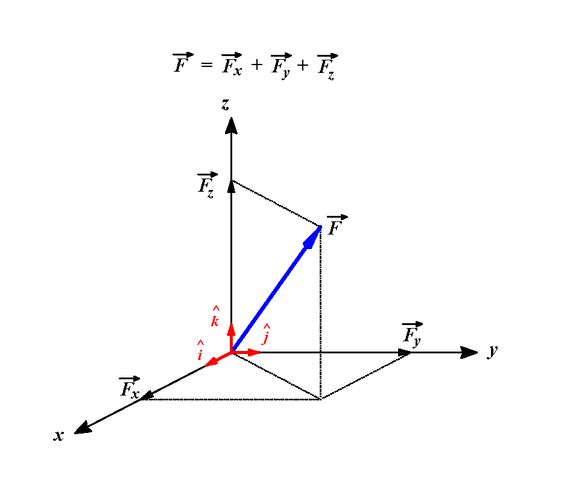

Първото нещо, с което ще се сблъскате в курса по **Геометрия** е именно **векторът**. Един от начините за представяне на вектор е чрез координати. Понеже всичко е "по-забавно" в 3-мерното пространсво, векторът в нашата задача ще се характеризира с **3 координати** - *x, y, z*. За целта създайте структура `Vector3D`, съдържаща в себе си нужната информация за един тримерен вектор.

Имплементирайте следната функционалност, свързана с вектори:

- Метод, който връща дължината на вектор.
- Метод, който пресмята скаларното произведение на два вектора.
- Метод, който дава отговор дали два вектора са перпендикулярни.
- Метод, който връща продуктът от векторното произведените на два вектора.

> Напишете и методи, които позволяват сериализация на обект от нашия тип `Vector3D`, съвместимо с двоични файлове.

> **Важно.**
> Всеки, който има github, нека качи решенията на задачите си и да ми прати link!
> За тези, които нямат - идеален момент да си направят.

